# **The Ring of the Wizard Werdna**
The code is written in python and creates a rogulike game.

- [**The Ring of the Wizard Werdna**](#wizard-werdna-ring)
  - [**Scope**](#scope)
  - [**Caves/Enviroment**](#cavesenviroment)
  - [**Hero**](#hero)
    - [**Hero Depiction**](#hero-depiction)
    - [**Hero Visiblity**](#hero-visiblity)
    - [**Hero Actions**](#hero-actions)
      - [**Movement of the Hero**](#movement-of-the-hero)
      - [**Attack**](#attack)
      - [**Rest**](#rest)
      - [**Health potion usage**](#health-potion-usage)
      - [**Mana potion usage**](#mana-potion-usage)
      - [**Picking up weapons**](#picking-up-weapons)
    - [**Hero level**](#hero-level)
  - [**Enemies**](#enemies)
  - [**Items**](#items)
    - [**Potions**](#potions)
    - [**Weapon**](#weapon)
      - [**Sword**](#sword)
      - [**Staff**](#staff)
      - [**Item Depiction**](#item-depiction)
      - [*Werdna ring*](#werdna-ring)
  - [**Hero Status**](#hero-status)
  - [**Game Log**](#game-log)
  - [**Summary**](#summary)

## **Scope**
Main goal of the game is the hero to find the Ring the Wizard Werdna. To achieve this the hero searches a cave complex. Each cave is inhabited by hostile creatures ready to attack our hero. The ring is located at the tenth and final cave.

## **Caves/Enviroment**
The environment of the game consists of caves, each cave is a 2d space of tiles. The tiles occupy 12x12 pixels on the screen and can be floor type (where the hero and the enemies can walk), wall type or stair type. The stair type tile is the entrance for the next cave. The color for each tile is red for the floor, black for the wall and pink for the stair. Each cave is randomly created every time the hero enters in it. The procedure used is a simple (in implementation) algorithm for creating dungeons of a rogue-like game. The algorithm name is “random-walk”, and it has been used in many rogue-like games. The way it works is the following, let assume that the cave consists of an N × M grid of tiles and all the tiles are characterized as walls. Then a percentage of tiles that will be the floor (on which the player and the opponents can move) is set, the algorithm starts from a random point and perform a random walk characterizing each grid it “steps” as floor until, the desired percentage is reached. An example of a cave depiction can be seen Figure 1.

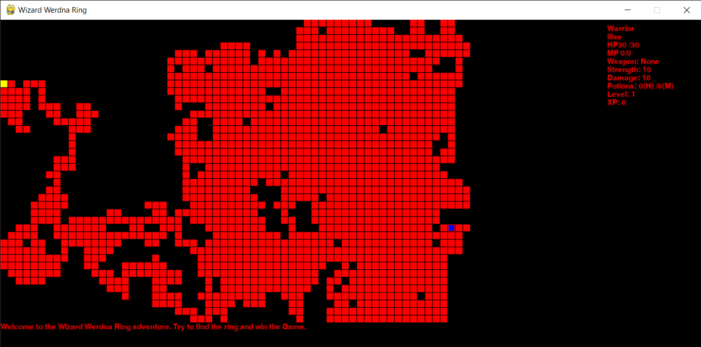
*Figure 1: A cave consist of 80×60 tiles with 46% Floor percentage.*

## **Hero**
For the hero of the game the player can choose between two types of characters warrior and wizard. The hero character is chosen at the first screen of the game by pressing 1 for the warrior type and 2 for the wizard. A screenshot of the introductory screen is given in Figure 2. 

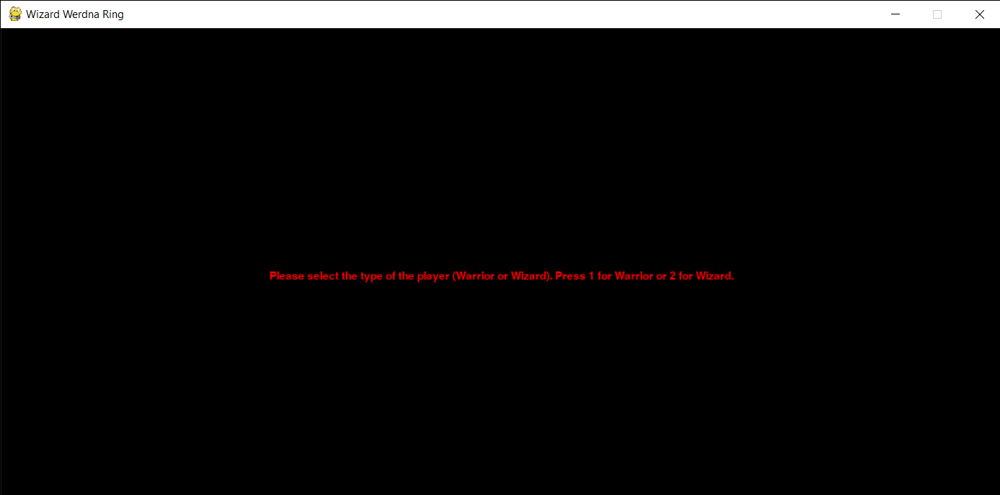
*Figure 2: The ring of the Wizard Werdna, introductory screen.*

The player can choose their hero's name by typing the desired name on the second screen of the game and pressing enter. Figure 3 shows the second screen of the game.
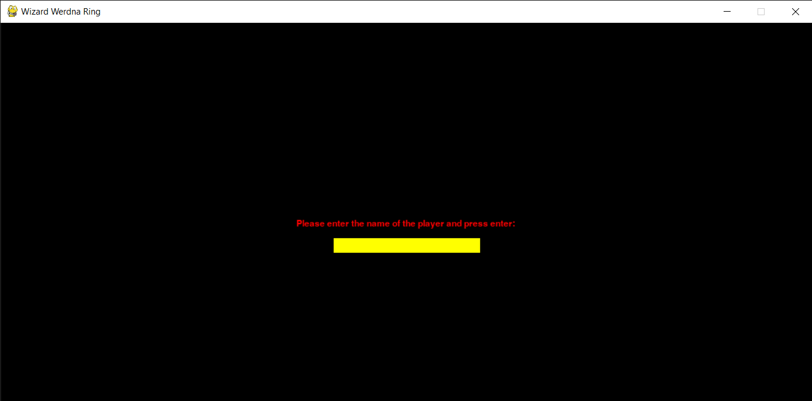
*Figure 3: The ring of the Wizard Werdna, name selection screen.*
### **Hero Depiction**
The Hero is depicted as a blue square. Figure 4 shows an example of the hero depiction.

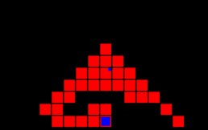
*Figure 4:Hero Depiction*
### **Hero Visiblity**
The hero can see for a distance equal to 6 map tiles if it is a floor, stairs, or wall and if there are enemies or items on them. For the tiles that are outside the visibility range there are two visibility categories, the unknown which means that the hero has not visited the region yet and can't know anything for this tile and the foggy which means the hero has visited the tile and knows if it is a wall or floor and if the tile has any item (the enemies are invisible in this case). Figure 5 depicts a typical game screen after the hero has explored part of the map.

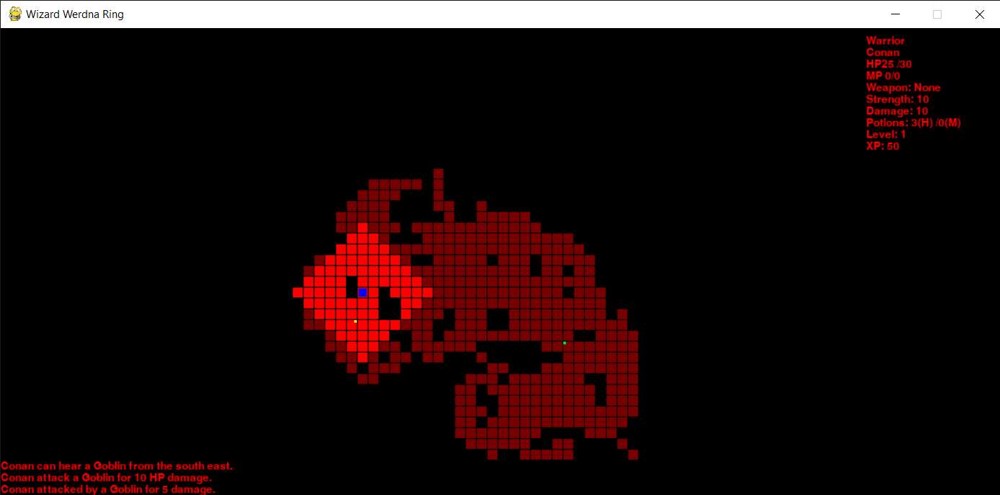
*Figure 5: A depiction of the game after some movements of the hero is given above. The bright red for the tiles means that are inside the Hero's visibility and the les opaque red means that the tiles visibility type is fogged.*

### **Hero Actions**
The type of actions the hero can perform are presented below. Keep in mind that only after the action of the hero the environment of the game reacts, in simple words first the Hero performs an action and in response the environment moves.
#### **Movement of the Hero**
The player can move the hero in the four directions using the keys w to move up, a to move left, s to move down and d to move right. For each movement the hero moves for one tile in the map/cave. Every time the hero moves there is a possibility that an enemy will be placed on the map. The possibility comes from the type p_0⁄e^((max_hero_hp)⁄(hero_hp))  where p_0 is between 0.1 and 0.25

#### **Attack**
Attack is performed by pressing the space button. Each type of Hero performs different type of attack. The Warrior uses sword and only attacks if the enemy is on the next tile, if there is more than one enemy nearby, the hero attacks the one with the least hp. The wizard uses the staff as weapon and use spells to attack. Because of this, the wizard attacks any visible enemy and if there is more than one enemy, attack priority is range, then enemy hp. Each time the wizard attacks 5 mana points is consumed. The damage done by the hero depends on the hero’s level and the weapon the hero possesses. The attribute that characterizes the damage the hero can do is strength for the warrior and intelligence for the wizard.

#### **Rest**
When the r key is pressed both hero types gain 4 HP. The wizard type hero also gains 4MP. When r is pressed there is a 25% possibility to place an enemy on the map. To increase the game difficulty, when the hero has seen the stair and the distance with the stairs is less than 35 tiles the rest function cannot be used.

**Hint:** The player can press the h button and the hero will consume one Health Potion and gain up to 20 HP.  

#### **Health potion usage**
You have to press h in order to use one health potion and earn 20 hitpoints.

#### **Mana potion usage**

The player can press the m button and the hero will consume one Mana Potion and gain up to 20 MP. The Mana potion can only be possessed by the wizard type of hero.

#### **Picking up weapons**
When the player moves to a tile that has a weapon, the hero can select that weapon by pressing the p key. The sword weapon that the warrior can acquire adds two boosts, one to the maximum HP the Hero can have and one to the Hero's strength. The staff is the weapon the wizzard can acquire and adds three boosts, one each to max HP, max MP, and intelligence. 

### **Hero level**
The Hero has a level that starts at the first and ends at the fifth. Each level determines the maximum HP for both hero types, maximum MP and intelligence for the wizard type hero, and strength for the warrior type. To level up, the hero collects XP by killing enemies The following tables show the level of the hero and the corresponding XP required for the hero to reach each level and the attributes that the Hero has at each level. The level also determines the enemies the Hero will encounter and the weapons on the map**Hint:** When the Hero change level and his hitpoints are 2/3 of the maximum hitpoints of the previous level automatically half of the health potion he posses are used.

|Level  |Experience Points  |Hitpoints  |Strength  |
|:-----:|:-----------------:|:---------:|:--------:|
|   1   |  0-299            |     30    |    10    |
|   2   |  300-899          |     60    |    20    |
|   3   |  900-2699         |     80    |    25    |
|   4   |  2700 - 6499      |     90    |    30    |
|   5   |  6500 - 1399      |     100   |    35    |

Table 1: Warrior level and corresponding attributes

|Level  |Experience Points  |Hitpoints  |Mana points| Inteligence|
|:-----:|:-----------------:|:---------:|:--------:|:-----------:|
|   1   |  0-299            |     20    |    30    |      10     |
|   2   |  300-899          |     40    |    50    |      20     |
|   3   |  900-2699         |     50    |    70    |      30     |
|   4   |  2700 - 6499      |     55    |    90    |      40     |
|   5   |  6500 - 1399      |     60    |    110   |      50     |

Table 2: Wizard level and corresponding attributes

## **Enemies**
Enemies in the game spawn during the hero's movement and when the Hero is resting. The type of enemy depends on the level of the Hero. Enemies have specific visibility, HP, strength, and XP. When killed by the hero they give their XP to the hero. They stand still until the hero is in their line of sight, then move towards the hero trying to close the distance and finally attack and reduce the hero's hit points by the amount of power they have. A table with the name of the enemy, the corresponding level the Hero must have to spawn that enemy, the depiction they have, and its characteristics are given below. Figure 6 gives an example of how enemies are depicted in the game.

|Hero Level  |Enemy name  |Hitpoints  |Strength| Experience points|Visibiliti|Depiction|
|:-----:|:-----------------:|:---------:|:--------:|:-----------:|:-----------:|:-------:|
|   1-2   |  Giant Rat      |     5    |    2    |      30     |         4      | Gray Square|
|   1-3   |  Goblin         |     15    |    5    |      50     |        7      |Yellow Circle|
|   3-4   |  Gray Slime     |     30    |    8    |      80     |        2      |White Square|
|   4-5   |  Orc Grunt      |     40    |    10    |     100     |       6      |Green Square|
|   3-5   |  Orc Warlord    |     50    |    12   |      120     |       7      |Dark Green Square|
|   4-5   |  Ettin          |     60    |    20   |      150     |       9      |Dark Grey Circle|
|   3-5   |  Skeleton       |     20    |    30   |      100     |       4      |White Recangle|
|     5   |  Wyrm           |     80    |    20   |      200     |       5      |Magenta Square|
|     5   |  Vampire        |     50    |    30   |      400     |       10     |Black Circle|

Table 3:Enemies of the Game

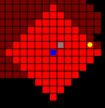
*Figure 6: Enemy rendering example (a giant rat and a Goblin)*

## **Items**

In the game, tiles can have items stored on them, the two main item categories are potions and weapons. There is also a special item the ring of the Wizard Werdna, which will be detailed below.

### **Potions**
Potions are used to restore the hero's HP and MP. The health potion restores the hero's HP up to 20 HP. The mana potion is only used by a wizard type hero and restores the hero's MP up to 20 MP. Potions are acquired by the hero automatically when he passes a tile on which they are stored. The maximum amount of potions a hero can have is 30 potions.

### **Weapon**
There are two types of weapons in the game, the sword and the staff. The sword can be wielded by a warrior and the staff by a wizard type of hero. Each weapon enhances specific characteristics of the Hero. The weapon and the total boost they provide depends on the hero's level when the weapon is created. The total boost is split between the boosts the weapon gives randomly. The table below gives the hero level and the corresponding total boost.  
|Hero Level|Total Boost|
|:--------:|:---------:|
|1|10|
|2|20|
|3|30|
|4|40|
|5|60|

*Table 4: Weapon total boost per Hero level*

#### **Sword**
The sword provides a boost to the maximum hit points a warrior can have and boosts the hero's strength and thus the damage he can deal.

#### **Staff**
The staff boosts the maximum HP and MP a wizard can have and boosts the hero's intelligence and thus the damage they can deal

#### **Item Depiction**
Items are depicted as a small square at the corner of the tile they are stored on. The potion types are shown in the upper right corner of the tile and the color is blue for the health potion and yellow for the mana potion. Weapons are depicted in the upper left corner with one color (yellow) for both. An illustration of the game items is given in Figure 7

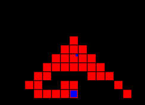 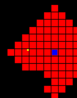 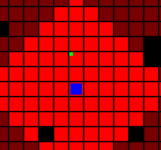

*Figure 7: Health potion illustration (left), Mana potion illustration (center) weapon illustration (right)*
#### **The ring of the Wizard Werdna**
This is a special item. It is the item for which our hero begins his adventure. When the item is found and picked by the hero the game ends. The depiction of the ring is the same with the stairs (a pink tile).

## **Hero Status**
The hero's status is displayed in the upper right corner of the game screen outside of the map display. The information presented is the hero's type, the hero's name, the hero's HP, the hero's MP, the name of the weapon the hero possesses, the strength of the warrior or the intelligence of the wizard, the damage that the hero can deal (the hero's strength or intelligence plus the boost from the weapon he wields), the potions the hero has, the hero's level, and finally the hero's current experience points. Figure 8 illustrates an example of the hero status. 

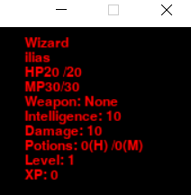

*Figure 8: Hero Status *

## **Game Log**
The game log is displayed in the lower left corner of the screen below the map screen and prints the last 5 game messages. The messages are related to various aspects of the game, such as the spawn location of an enemy relative to the hero's location, HP/MP restored after using a potion, the name of the weapon and its boosts, etc. Figure 9 illustrates an example of the game log. 

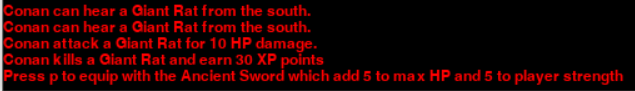

*Figure 9: An example of the game log*

## **Summary**
This game will be used for the development of artificial inteligence (AI) agent. The agent will play the game from the Hero prespective.